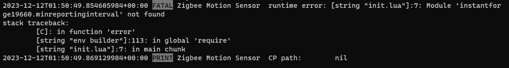
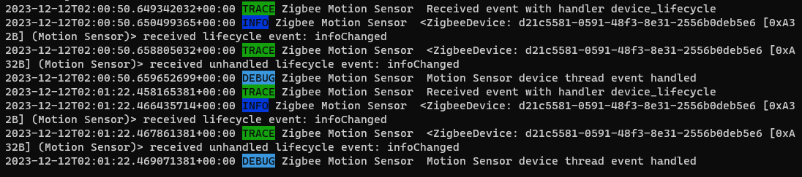
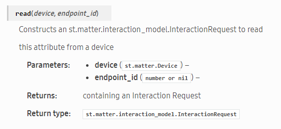

## yara-edge-driver

The main edge driver we use in this project is zigbee-motion-sensor.

In side zigbee-motion-sensor folder, we have 3 folders: capabilities, profiles, and src

# Install the edge driver

You can follow these steps to install the edge driver for the motion sensor: https://developer.smartthings.com/docs/devices/hub-connected/driver-components-and-structure#profiles

# Capabilities:

I created two custom capabilities to show the min and max interval time (hiddenAttributesMin and hiddenAttributesMax). The custom capabilities are used for showing the values of minReportingInterval and minReportingInterval in the preferences.

# Profiles:

The main profile I use in this project is motion-temp-battery.yml. In this project, I added two custom preferences which are minReportingInterval and maxReportingInterval

Goal: I need to make them show on the UI. When users update the min and max values in the setting, they will show on the main page of the device.

# Src:

In the init.lua, I have addded handlers in order to handle the events when we change the values of minReportingInterval and maxReportingInterval. I have got the logic for the minReportingInterval and maxReportingInterval which is

```lua
local function interval_check_handler(driver, device)
  local minInterval = device.preferences.minReportingInterval
  local maxInterval = device.preferences.maxReportingInterval

if minInterval < 30 or maxInterval > 3600 then
    driver:log("Error: Reporting interval is out of acceptable range")
  end
end
```

# Challenges (update 12/01/2023):

I still cannot get and set the values of minReportingInterval and maxReportingInterval

```lua
local function get_pref_min(device)
  return device:get_field(device.preferences.minReportingInterval)
end

local function set_pref_min(device,value)
  device:set_field(device.preferences.minReportingInterval, value)
end

local function get_pref_max(device)
    return device:get_field(device.preferences.maxReportingInterval)
end

local function set_pref_max(device, value)
    device:set_field(device.preferences.maxReportingInterval, value)
end
```

# Update 12/04

I got the customize capabilities in the profile without errors.

# Challenges (update 12/04/2023):

Register this profile with SmartThings using CLI or API

Now reference those registered custom capabilities in motion-temp-battery.yml

Note for custom capabilities:

https://community.smartthings.com/t/edge-drivers-driver-presentation-and-custom-capabilities/249290

https://developer.smartthings.com/docs/devices/capabilities/custom-capabilities

# Update 12/05

Creating presentations for Max and Min values

Example of custom capabilities and presentation

https://github.com/SmartThingsDevelopers/SampleDrivers/blob/main/custom-capability/src/init.lua#L7

Tutorial: https://community.smartthings.com/t/custom-capability-and-cli-developer-preview/197296?page=37

https://www.youtube.com/watch?v=jSg94DgItSE&t=345s

https://community.smartthings.com/t/custom-capability-and-cli-developer-preview/197296

# Update 12/08

Got the minIntervalValue on the main screen of the Smartthings app. Using hiddenAttributesMin.yaml, hiddenAttributesMin_presentation.yaml, and hiddenAttributesMin_presentation.json to create the section.

Update the maxIntervalValue.

# Update 12/11

Cannot match the values of Min and Max in the Settings with the display. Use this tutorial to check it again. https://developer.smartthings.com/docs/devices/configurations-and-presentations/device-configurations



The log can capture the event, but it cannot display it after fixing the code. 



# Update 12/20

https://developer.smartthings.com/docs/edge-device-drivers/matter/generated/clusters/OccupancySensing.html

